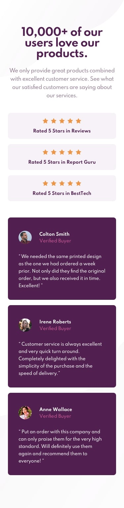

# Social proff section

## Guia para poder descargar la plantilla

> Link para que puedan verlo antes de descargarlo: https://pedrofariassosa.github.io/social-proof-section/

* Necesita clonarlo (descargarlo) en la máquina local usando   
```
  $ git clone https://github.com/PedroFariasSosa/social-proof-section.git
```
* Esto hace una copia local del repositorio en su máquina.
Una vez que haya clonado el repositorio piedra-papel-tijera en Github, muévase primero a esa carpeta usando el comando de cambio de directorio en Linux, Windows y Mac.   
````
  $ cd social-proff-section
````
* y por ultimo vas a ejecutar el archivo **index.html**
### Tecnologias utilizadas

* HTML
* CSS
* Custom properties

### Metodologia

* BEM

### Diseños de la aplicacion

<details>
    <summary>💻 Version de escritorio</summary>
    


</details>

<details>
  <summary>📱 Version para telefonos</summary>

  

</details>

>Si te sirvio de ayuda deja tu estrellita me ayudas a mucho para seguir ayudando a la comunidad   
> Si te gusto el contenido sigueme en mis redes sociales  
<a href="https://www.instagram.com/pedro_farias10/" target="_blank"></a>
<a href="https://www.facebook.com/profile.php?id=100032499663837" target="_blank"></a>
<a href="https://https://www.facebook.com/DreamCodeFarias" target="_blank"></a>